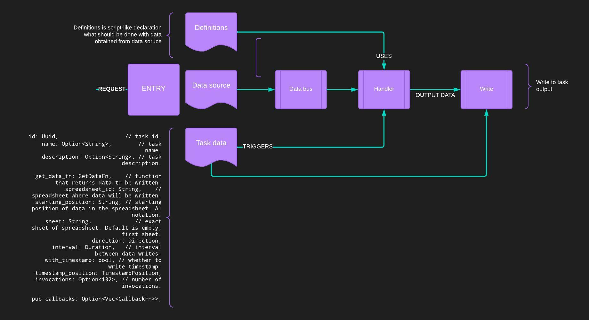

# DataTracker

[](https://codecov.io/gh/kamilWyszynski1/data-tracker)

DataTracker is an application that tracks various kinds of data and performs some kind of work on them.

## TrackingTasks
TrackingTask is main entity in this project - it contains information about how and when task if performed. In the example below, task will triggered by Kafka message:

```rust
TrackingTask::new(
        empty_string.clone(),
        empty_string,
        String::from("A1"),
        Direction::Horizontal,
        None,
        TaskKindRequest::Triggered(Hook::Kafka {
            topic: String::from("test_topic"),
            group_id: String::from("1"),
            brokers: String::from("localhost:9092"),
        }),
    )
```

Here's basic json representation of TrackingTask:
```json
{
    "name": "name",
    "description": "description",
    "spreadsheet_id": "id",
    "sheet": "sheet",
    "starting_position": "A1",
    "direction": "horizontal",
    "definition": {
        "steps": [
            "DEFINE(var, VEC(1,2,3,4,GET(IN)))",
            "DEFINE(OUT, GET(var))"
        ]
    },
    "input_type": "json",
    "url": "whatever",
    "kind_request": {"Triggered": {"PSQL": {"db":"test","host":"host","password":"pass","port":5432,"channel":"channel","user":"user"}}}
}
```

## TaskKinds 
TaskKind indicates how task is triggered:

```rust
pub enum TaskKind {
    Ticker { ... },
    Triggered { ... },
    Clicked { ... }, 
}
```

## TaskDefinition
TaskDefinition is set of instruction given to TrackingTask that will be called on TaskInput.
This works as simple kind of language that currently supports those keywords:
```rust
pub enum Keyword {
    None,
    Define,
    Get,
    Json,
    Object,
    Vec,
    Extract,
    Bool,
    Int,
    Float,
    Add,
    Sub,
    Div,
    Mult,
    HTTP,
    Log,
    RunSubtree,
    Break,
    If,
    Eq,
    Neq,
    Map,
    MapInPlace,
    Filter,
}
```

For usage look at test inside `/src/lang/lexer.rs`.


## Basic flow
 
